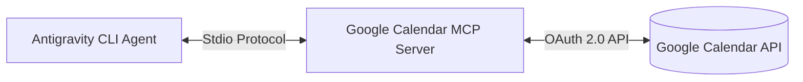

# 📅 Google Calendar MCP Complete Setup Guide (From Scratch)

This guide walks you through setting up the **Google Calendar Model Context Protocol (MCP)** server on Windows, macOS, or Linux from scratch. 

Once configured, Antigravity CLI can autonomously check your university class schedules, audit free/busy blocks, generate dynamic daily notes, and schedule spaced-repetition exam study blocks ($D-14, D-7, D-3, D-1$) directly onto your Google Calendar.

---

## 🏗️ Architecture & Requirements



### Prerequisites
- **Node.js**: Version 18 or newer installed (`node -v` and `npx -v` in terminal).
- **Google Account**: Your personal or university Google account.

---

## 🚀 Step 1: Create OAuth 2.0 Credentials in Google Cloud Console

1. Navigate to the [Google Cloud Console](https://console.cloud.google.com/).
2. Create a new project (e.g., `Antigravity-Second-Brain`).
3. **Enable Google Calendar API**:
   - Go to **APIs & Services** $\rightarrow$ **Library**.
   - Search for **Google Calendar API** and click **Enable**.

4. **Configure OAuth Consent Screen**:
   - Go to **APIs & Services** $\rightarrow$ **OAuth consent screen**.
   - Select **External** (or **Internal** if using a Google Workspace organization) and click **Create**.
   - Fill in:
     - **App name**: `Antigravity Calendar MCP`
     - **User support email**: Your email address
     - **Developer contact email**: Your email address
   - Click **Save and Continue**.
   - Under **Scopes**, click **Add or Remove Scopes**, check:
     - `.../auth/calendar` (or `.../auth/calendar.events`)
   - Under **Test Users**, click **Add Users** and enter your Google account email. *(Important: Unverified test apps can only authenticate emails listed here).*
   - Click **Save and Continue**.

5. **Create Desktop Client Credentials**:
   - Go to **APIs & Services** $\rightarrow$ **Credentials** $\rightarrow$ **+ CREATE CREDENTIALS** $\rightarrow$ **OAuth client ID**.
   - Select **Application type**: **Desktop app**.
   - **Name**: `Antigravity Desktop Client`.
   - Click **Create**.
   - Copy your **Client ID** and **Client Secret** (or click **Download JSON**).

---

## ⚙️ Step 2: Configure Antigravity `mcp_config.json`

Create or edit your global Antigravity MCP configuration file:

- **Windows Path**: `C:\Users\<Your-Username>\.gemini\config\mcp_config.json`
- **macOS / Linux Path**: `~/.gemini/config/mcp_config.json`

Add the `google-calendar` server configuration:

```json
{
  "mcpServers": {
    "google-calendar": {
      "command": "npx",
      "args": [
        "-y",
        "@cocal/google-calendar-mcp"
      ],
      "env": {
        "GOOGLE_CALENDAR_CLIENT_ID": "YOUR_CLIENT_ID.apps.googleusercontent.com",
        "GOOGLE_CALENDAR_CLIENT_SECRET": "YOUR_CLIENT_SECRET"
      }
    }
  }
}
```

> [!NOTE]
> Replace `YOUR_CLIENT_ID` and `YOUR_CLIENT_SECRET` with the credentials generated in Step 1.

---

## 🔑 Step 3: Initial Authorization (One-Time Login)

1. Open your terminal (PowerShell, Command Prompt, or bash) and run:
   ```bash
   npx -y @cocal/google-calendar-mcp
   ```
2. Your default web browser will open requesting permissions for your Google Calendar.
3. Select your Google account and click **Allow**.
   - *(If a screen says "Google hasn’t verified this app", click **Advanced** $\rightarrow$ **Go to Antigravity Calendar MCP (unsafe)**).*
4. Once authorized, the OAuth refresh tokens are stored locally:
   - Windows: `C:\Users\<Your-Username>\.config\google-calendar-mcp\tokens.json`
   - macOS / Linux: `~/.config/google-calendar-mcp/tokens.json`

---

## 💻 Step 4: Fast Machine-to-Machine Migration (Alternative)

If you already completed Steps 1–3 on another computer, you can skip Google Cloud Console by copying two files to this new machine:

1. **MCP Configuration**:
   - Copy `mcp_config.json` $\rightarrow$ `C:\Users\<Your-Username>\.gemini\config\mcp_config.json`
2. **Cached Tokens**:
   - Copy folder `google-calendar-mcp/` $\rightarrow$ `C:\Users\<Your-Username>\.config\google-calendar-mcp\`

---

## 🧪 Step 5: Verification & Vault Agent Commands

Restart Antigravity CLI or start a new conversation. Antigravity will automatically detect the server and inject these tools:
- `list-events`: Audits upcoming classes, meetings, and exams.
- `create-event`: Schedules spaced repetition study sessions and milestones.
- `get-freebusy`: Finds optimal non-conflicting study windows.

### Example Prompts to Test
- *"Check my Google Calendar schedule for tomorrow and build my daily note."*
- *"Schedule spaced repetition blocks for my COMS 3110 Midterm 1 on October 1."*
- *"Run session startup briefing."*

---

## 🛠️ Troubleshooting

| Issue | Solution |
| :--- | :--- |
| **`Error 403: access_denied` / App not verified** | Ensure your email is added under **Test Users** on the Google Cloud OAuth Consent screen. |
| **Command `npx` not found** | Install [Node.js](https://nodejs.org/) (LTS version) and ensure it is added to your system `PATH`. |
| **Token expired or revoked** | Delete `~/.config/google-calendar-mcp/tokens.json` and run `npx -y @cocal/google-calendar-mcp` to re-authenticate. |
| **Wrong Timezone** | Ensure the MCP environment or events specify `America/Chicago` (or your local timezone). |
